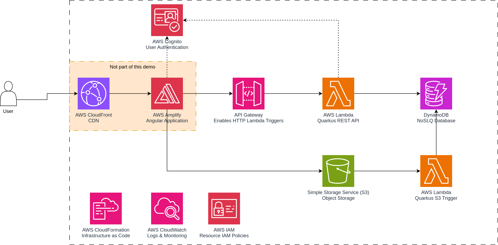

# Serverless Java on AWS

### Overview

This repository shows a small application using several AWS components with a serverless deployment model.

The following diagram shows some of the components that are used:

The project consists of:
 * `quarkus-app`: Quarkus on AWS Lambda
   * `serverless-java-rest-api`
     * Uses [quarkus-amazon-lambda-http](https://quarkus.io/guides/aws-lambda-http) to start an embedded resteasy container proxied by the AWS runtime.
     * Uses [quarkus-oidc](https://quarkus.io/guides/security-oidc-bearer-token-authentication-tutorial) for OIDC authentication on REST endpoints.
   * `serverless-java-s3-trigger` 
     * Uses [quarkus-amazon-lambda](https://quarkus.io/guides/aws-lambda) as a generic Lambda trigger.
     * Listens to AWS S3 file creation/deletion triggers through the CloudFormation templates.
   * Both use [quarkus-amazon-dynamodb](https://docs.quarkiverse.io/quarkus-amazon-services/dev/amazon-dynamodb.html) to talk with a backing on-demand DynamoDB.
 * `aws-sam`: AWS CloudFormation YAML files for deploying the necessary infrastructure.

Since DynamoDB runs in on-demand mode and Lambdas terminate right after execution, the running costs totals to 0€ for this demo (if you remain within reasonable limits).

Some of the other supporting services are:
 * AWS CloudFormation: Allows definition of our AWS infrastructure as code.
 * AWS CloudWatch: Automatically collects logs and monitoring metrics.
 * AWS IAM: Used for access management between our AWS Services (e.g. AWS Lambda -> DynamoDB).
 * AWS API Gateway: Required to have HTTP requests invoke the backing Lambda trigger.
 * AWS Cognito: User authentication used by both the frontend and Quarkus REST API.
 * AWS Amplify: Not really mandatory, but could help setting up a frontend application quite quickly with the necessary AWS SDKs.
 * AWS CloudFront: CDN for the Angular application. Allows running HTTPS for a static webapp stored in S3.
  

### Local Environment Requirements
 * [AWS CLI](https://aws.amazon.com/cli/): General AWS CLI
 * [AWS SAM CLI](https://docs.aws.amazon.com/serverless-application-model/latest/developerguide/install-sam-cli.html): Used to deploy our CloudFormation stack
 * [Docker](https://www.docker.com/)/[Podman](https://podman.io/): Used for TestContainers (LocalStack/Keycloak) by Quarkus in dev mode (and/or building to native images)

### Running locally

Simply run the Quarkus apps through IntelliJ or through `mvnw quarkus:dev`.

### Deploying to AWS

1. First we build our quarkus applications to [native images](https://quarkus.io/guides/building-native-image).  
   `mvn clean install -Pnative -Dquarkus.native.container-build=true`  
   The `quarkus.native.container-build` build flag is used on Windows to build the native Linux image inside a Docker container.
2. Then we can deploy through AWS SAM.  
   `sam deploy -t aws-sam/parent.sam.yaml`